<picture>
  <source media="(prefers-color-scheme: dark)" srcset="./assets/profile-hero-dark.svg" />
  <source media="(prefers-color-scheme: light)" srcset="./assets/profile-hero-light.svg" />
  
</picture>

<h3 align="center">Frontend first. Mobile focused. Growing into the full stack.</h3>

<p align="center">
  I build product-focused mobile interfaces with React Native, Expo, and TypeScript.<br/>
  I also work with Node.js and Express, while actively improving my PostgreSQL and database-design skills.
</p>

## About me

- Frontend-focused developer working mainly with **React Native, Expo, and TypeScript**
- Comfortable building state-driven interfaces with **Redux Toolkit**
- Able to create REST APIs with **Node.js and Express**
- Actively developing my **PostgreSQL, SQL, and database architecture** knowledge
- Interested in clean UI systems, predictable data flow, and practical product design
- Based in Türkiye

## Toolbox

<p>
  <strong>Frontend</strong><br/>
  
</p>

<p>
  <strong>Backend & database — growing</strong><br/>
  
</p>

<p>
  <strong>Workflow</strong><br/>
  
</p>

## Featured work

<table>
  <tr>
    <td width="50%" valign="top">
      <h3><a href="https://github.com/mustafasenyusz/Ruya-Sitesi">Rüya Sitesi</a></h3>
      <p>A role-based residential management platform for admins, managers, and residents, covering users, notices, dues, issues, and site settings. It connects an Expo client to Express and PostgreSQL through configurable API flows.</p>
      <p><strong>React Native · Expo · TypeScript · Node.js · PostgreSQL</strong></p>
    </td>
    <td width="50%" valign="top">
      <h3><a href="https://github.com/mustafasenyusz/SenyuzKafe">SenyuzKafe</a></h3>
      <p>A multi-role cafe operations app for customers, waiters, kitchen, cashier, and admins, covering tables, menus, orders, and payments. Authentication is backed by Express and PostgreSQL, with operational modules designed for staged API migration.</p>
      <p><strong>React Native · Expo · TypeScript · Redux Toolkit · Node.js</strong></p>
    </td>
  </tr>
  <tr>
    <td width="50%" valign="top">
      <h3><a href="https://github.com/mustafasenyusz/BillBuddy">BillBuddy</a></h3>
      <p>A polished bill-management experience built around typed state, persistent local data, and detailed mobile UI.</p>
      <p><strong>React Native · Expo · TypeScript · Redux Toolkit</strong></p>
    </td>
    <td width="50%" valign="top">
      <h3><a href="https://github.com/mustafasenyusz/Astra-Focus">Astra Focus</a></h3>
      <p>A priority-driven goal manager with file-based routing, focused visual hierarchy, and persisted state.</p>
      <p><strong>Expo Router · TypeScript · Redux Persist</strong></p>
    </td>
  </tr>
  <tr>
    <td width="50%" valign="top">
      <h3><a href="https://github.com/mustafasenyusz/Memoirly">Memoirly</a></h3>
      <p>An offline-first personal journal documenting my move toward a more maintainable frontend architecture.</p>
      <p><strong>React Native · Redux Toolkit · AsyncStorage</strong></p>
    </td>
    <td width="50%" valign="top">
      <h3><a href="https://github.com/mustafasenyusz/SenyuszPay">SenyuszPay</a></h3>
      <p>A mobile expense tracker connected to a custom Express API and PostgreSQL database.</p>
      <p><strong>React Native · Node.js · Express · PostgreSQL</strong></p>
    </td>
  </tr>
  <tr>
    <td width="50%" valign="top">
      <h3><a href="https://github.com/mustafasenyusz/JournalStack">JournalStack</a></h3>
      <p>A full-stack journal exploring user-specific relational data and mobile-to-API communication.</p>
      <p><strong>Expo · Express · PostgreSQL</strong></p>
    </td>
    <td width="50%" valign="top">
      <h3><a href="https://github.com/mustafasenyusz/Listora">Listora</a></h3>
      <p>A clean shopping-list client backed by account-based API routes and persistent PostgreSQL data.</p>
      <p><strong>React Native · Node.js · Express · PostgreSQL</strong></p>
    </td>
  </tr>
</table>

## Current direction

```text
Strongest today     → React Native, Expo, TypeScript, frontend architecture
Already building    → Node.js and Express REST APIs
Actively improving  → PostgreSQL, SQL modeling, backend structure and testing
```

## GitHub activity

<p align="center">
  
  
</p>

## Contribution journey

<p align="center">
  <picture>
    <source media="(prefers-color-scheme: dark)" srcset="https://raw.githubusercontent.com/mustafasenyusz/mustafasenyusz/output/github-contribution-grid-snake-dark.svg" />
    <source media="(prefers-color-scheme: light)" srcset="https://raw.githubusercontent.com/mustafasenyusz/mustafasenyusz/output/github-contribution-grid-snake.svg" />
    
  </picture>
</p>

<p align="center">
  <a href="https://github.com/mustafasenyusz?tab=repositories">
    
  </a>
</p>
